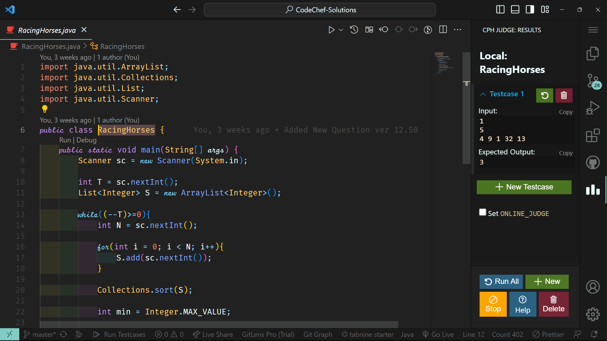
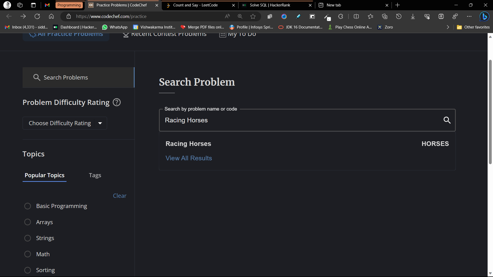

# CodeChef Problems

## Intro

Hello myself *Siddharth Sutar*. I'm a devloper who likes to do a lot of problems. In order to list all problems that I solve I made this repo. Hope you find this helpful. THank you!

    Note: These are solutions in java only.

    I haven't pasted the questions because you can just search on codechef by copying the file name and adding space to it!

## How To search?

Firstly Copy The Class Name

Search on [CodeChef](https://www.codechef.com/practice "CodeChef") & Add space between two words here!

Boom click on the problem & you r done!
